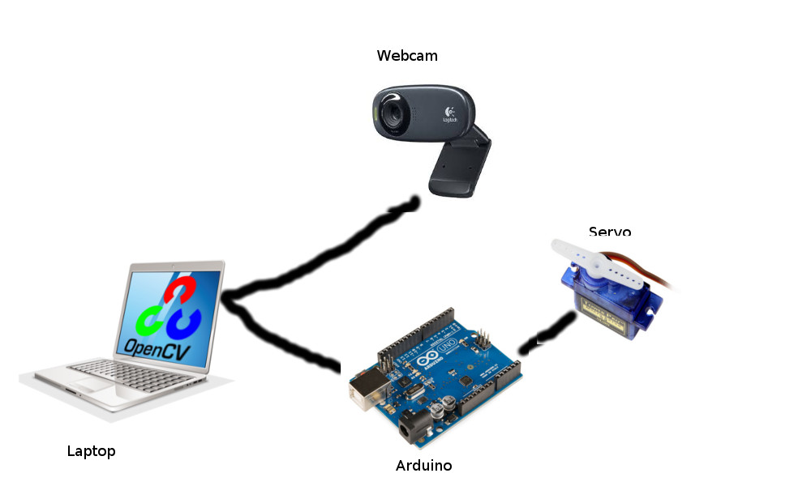
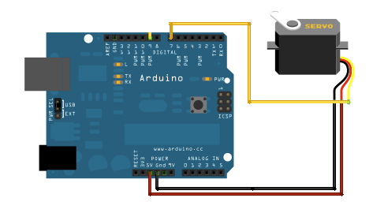
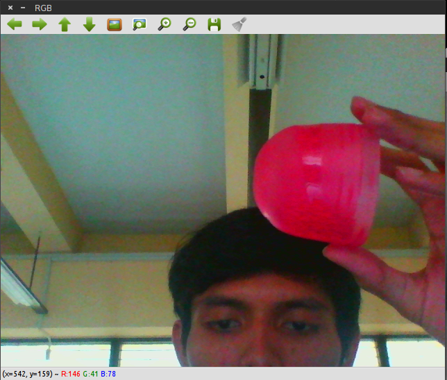
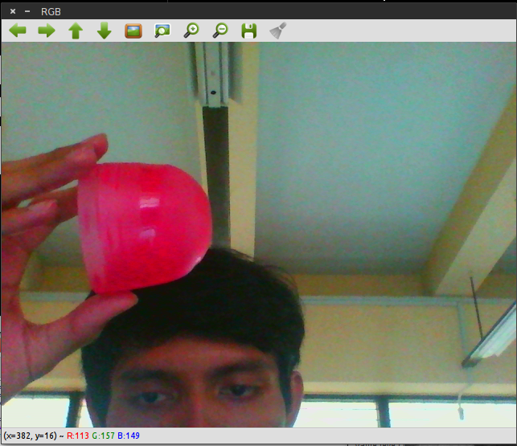
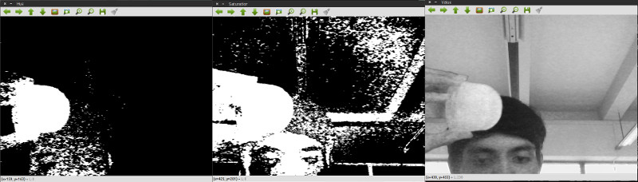
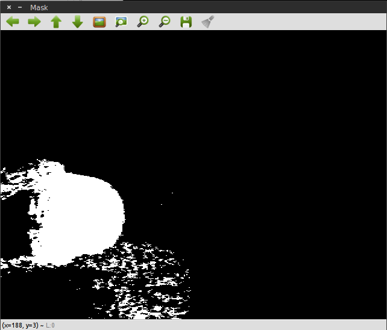
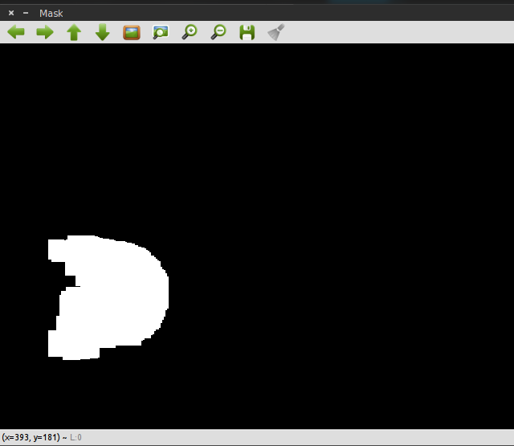
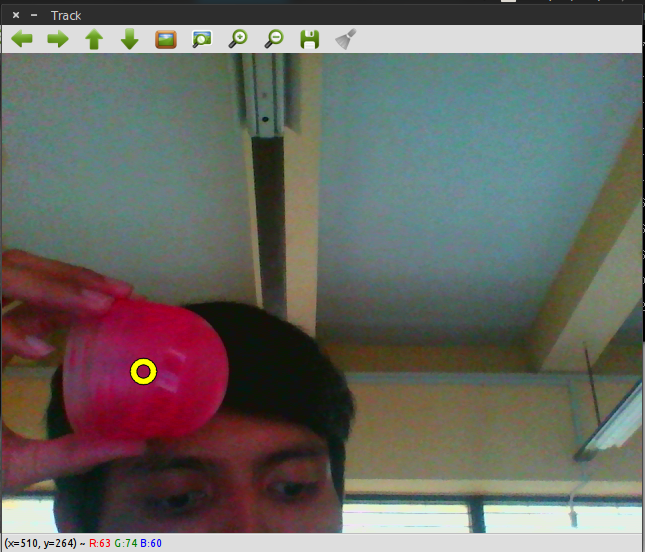
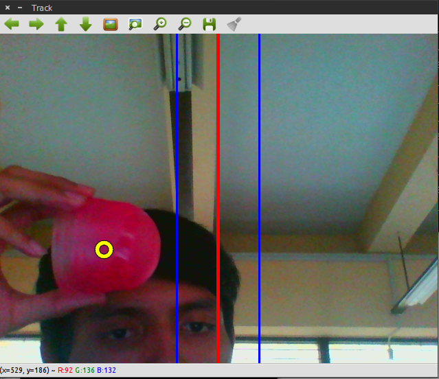

# How to built?

### main Code
- traking.cpp
- tracking-arduino.cc

## How to config. hardware
1. assemble arduino, webcam, servo (like this picture)



2. connect servo to vvc, gnd, digitalpin(7) on arduino port


## built "tracking-arduino.cc" to your arduino
- open tracking-arduino.cc to your arduino IDE
- connect your arduino board to computer and select port where port conected (ex: ttyACM0)
- built code to your board
- (don't unplug your arduino board from computer)

## Built "traking.cpp" with your computer (was installed opencv 3.0 or you can modif this code)
```
g++ -ggdb `pkg-config --cflags opencv` -o `basename <file hasil> .cpp` <code file> `pkg-config --libs opencv`
```
ex:
```
g++ -ggdb `pkg-config --cflags opencv` -o `basename hasil .cpp` tracking.cpp `pkg-config --libs opencv`
```
 
## run program
```
./hasil
```

select red color in hue range with trackbar:
1. put objek (red color) to front of your camera
2. in trackbar 
- first row (hue level) = 170
- second row (hue level) = 200 
3. so, you can track object 

## How it's work
1. record video from camere (index 0)
> CvCapture* capture = cvCreateCameraCapture(0);
2. process each frame
> IplImage* frame = cvQueryFrame(capture);



3. flip frame image right-left
> cvFlip(frame, frame,1);



4. Convert RGB to HSV
> cvCvtColor(frame, hsv, CV_BGR2HSV);
5. Split HSV (3 channel)
> cvSplit(hsv, chan_hue, chan_sat, chan_val, 0);

!

6. add frame hue and saturation
> cvAnd(chan_hue, chan_sat, chan3);



7. Erosi and dilasi
>cvErode(chan3, chan3, 0, 9);
        cvDilate(chan3, chan3, 0, 9);



8. Count center of object
>cvMoments(chan3, &moments, 1);
        int                 r = sqrt(moments.m00); 
        int                 x = moments.m10/moments.m00;
        int                 y = moments.m01/moments.m00;

9. Draw Circle in center of object
> if (x > 0 && y > 0)
        {
            cvCircle(monitor, cvPoint(x, y), r, cvScalar(0, 0, 0), 4, CV_AA, 0); //lingkaran outline
            cvCircle(monitor, cvPoint(x, y), r, cvScalar(255, 255, 255), 2, CV_AA, 0); //lingkaran fill in
        }



10. draw line to target area
> cvLine(result, cvPoint(target - 60, 0), cvPoint(target - 60, 480), cvScalar(255, 0, 0), 2);
        cvLine(result, cvPoint(target, 0), cvPoint(target, 480), cvScalar(0, 0, 255), 3);
        cvLine(result, cvPoint(target + 60, 0), cvPoint(target + 60, 480), cvScalar(255, 0, 0), 2);


